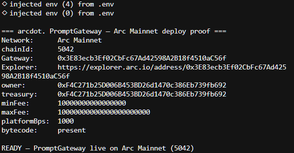
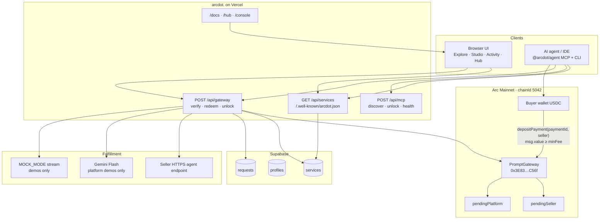
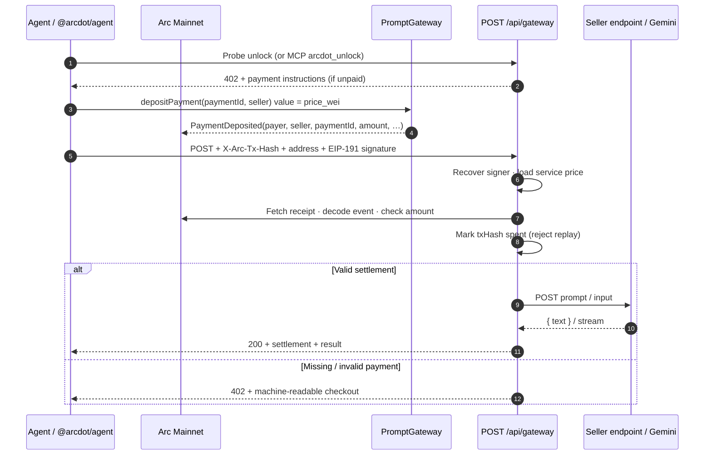
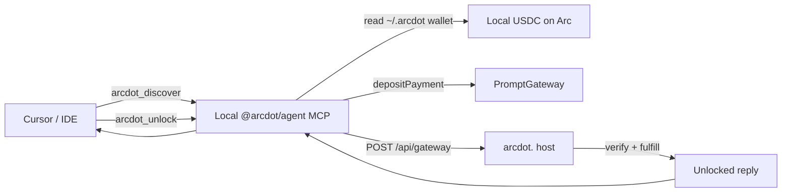

# arcdot.

**Pay-as-you-go API access for AI agents — settled in native USDC on [Arc](https://www.arc.network).**

[](https://arcdot-5cpk-xi.vercel.app)
[](https://docs.arc.network)
[](https://explorer.arc.io/address/0x3E83ecb3Ef02CbFc67Ad42598A2B18f4510aC56f)
[](https://www.npmjs.com/package/@arcdot/agent)
[](#license)

arcdot. is an **API monetization gateway** for the agentic economy. It turns ordinary HTTPS endpoints into **machine-payable services**: an agent discovers a tool, pays a few cents in USDC on Arc, proves the payment, and unlocks a reply — no accounts, no invoices, no human checkout.

| | |
|---|---|
| **Live app** | [arcdot-5cpk-xi.vercel.app](https://arcdot-5cpk-xi.vercel.app) |
| **Docs** | [Docs home](https://arcdot-5cpk-xi.vercel.app/docs) · [Quickstart](https://arcdot-5cpk-xi.vercel.app/docs/quickstart) · [Agents](https://arcdot-5cpk-xi.vercel.app/docs/agents) · [Sellers](https://arcdot-5cpk-xi.vercel.app/docs/sellers) · [Gateway API](https://arcdot-5cpk-xi.vercel.app/docs/api/gateway) · [MCP](https://arcdot-5cpk-xi.vercel.app/docs/mcp) · [Payment](https://arcdot-5cpk-xi.vercel.app/docs/payment) |
| **Hub (agent setup)** | [Create / import wallet → fund → IDE](https://arcdot-5cpk-xi.vercel.app/hub) |
| **Contract** | [`PromptGateway` on Arc Mainnet](https://explorer.arc.io/address/0x3E83ecb3Ef02CbFc67Ad42598A2B18f4510aC56f) — `0x3E83ecb3Ef02CbFc67Ad42598A2B18f4510aC56f` |
| **Network** | [Arc Mainnet](https://docs.arc.network) · Chain ID `5042` · RPC `https://rpc.mainnet.arc.io` |
| **Explorer** | [explorer.arc.io](https://explorer.arc.io) |
| **Agent client** | [`@arcdot/agent`](https://www.npmjs.com/package/@arcdot/agent) on npm |
| **Repo** | [github.com/M4N4N22/arcdot.](https://github.com/M4N4N22/arcdot.) |

---

## Demo video

End-to-end walkthrough on **Arc Mainnet**: publish a tool → wire Cursor MCP → agent pays USDC → unlock reply → seller withdraws.

**▶ [Watch the demo on YouTube](https://youtu.be/DEnLHr2haNo)**

### What happens in the video

1. **Publish a tool on Arc** — In Studio we publish a briefing tool (`demo-brief` / `demo-test-tool`) that summarizes a long thread. It goes live on the arcdot. catalog with an HTTPS agent endpoint and a USDC-on-Arc price.
2. **Configure MCP in Cursor** — We point Cursor at `@arcdot/agent` with origin `https://arcdot-5cpk-xi.vercel.app`. The arcdot MCP server comes up (`arcdot_discover`, `arcdot_unlock`, `arcdot_health`).
3. **Strict agent prompt** — We give Cursor a forced-MCP prompt so the model cannot answer from its own knowledge or skip payment:

   > You have MCP tools from the "arcdot" server. You MUST call them — do not answer from knowledge.
   >
   > 1. Call `arcdot_discover` with query `"demo-test-tool"`
   > 2. Call `arcdot_unlock` with service `"demo-test-tool"` and prompt:  
   >    `"Reply in exactly two short sentences: what is arcdot and why do agents pay per request?"`
   > 3. Return only the unlocked service text, plus one line listing the MCP tools you called in order.

   The specificity matters: a simple question like this is easy for any LLM/IDE to invent. The prompt forces discover → unlock through arcdot. so settlement is real.
4. **Create agent wallet** — Unlock needs a local buyer wallet. Cursor offers **create** or **import**; we approve **create**. `@arcdot/agent` writes `~/.arcdot/wallet.json` and returns a [fund link](https://arcdot-5cpk-xi.vercel.app/fund).
5. **Fund with 0.5 USDC on Arc** — We send ~0.5 USDC to the new agent address, then tell Cursor the wallet is funded and to **retry**.
6. **Paid unlock succeeds** — The agent settles on `PromptGateway`, redeems via the gateway, and returns the unlocked service text, e.g.:

   > arcdot. lets agents pay a few cents in USDC on Arc, reach gated APIs instantly, and keep going without human checkout friction.
   >
   > MCP tools called: arcdot_unlock

7. **Seller sales** — Back in the app, Activity / Studio shows the sale for `demo-test-tool`: **Delivered**, prompt echoed, **0.0090 USDC on Arc** credited to the seller (90% after the 10% platform cut).
8. **Withdraw on mainnet** — From `/studio` we click **Withdraw**. Seller balance pulls on-chain (`withdrawSeller`). Example mainnet withdraw receiving **0.036 USDC**:  
   [`0x629cbd40d036599fa0a1ac3fdc458dbd2571e63827140b39c8b3255b9f09f3d9`](https://explorer.arc.io/tx/0x629cbd40d036599fa0a1ac3fdc458dbd2571e63827140b39c8b3255b9f09f3d9)

---

## What is arcdot.?

AI agents can already call APIs. They still cannot **pay for them** in a way that is tiny, instant, dollar-denominated, and autonomous.

Today’s premium models and data APIs are gated by API keys and human billing. That breaks agent workflows: someone has to open a dashboard, enter a card, copy a key, and rotate secrets. arcdot. adds a thin economic layer on Arc:

**discover → pay native USDC on Arc → verify on-chain → unlock → respond**

### Deep product model

| Actor | What they do |
|---|---|
| **Buyers / agents** | Discover a service slug, settle `depositPayment` on `PromptGateway`, call `POST /api/gateway` (or MCP `arcdot_unlock`) with proof + signature, receive the upstream result |
| **Sellers** | Publish an HTTPS **agent endpoint** in Studio, set a price (≥ platform floor), earn pending USDC on Arc, withdraw with `withdrawSeller` |
| **Platform** | Hosts catalog + settlement API, takes a constructor-locked platform cut (`platformFeeBps`), withdraws with `withdrawPlatform` |
| **Arc** | Stablecoin-native L1: USDC is gas **and** micropayment asset — one balance for fees and unlocks |

arcdot. is a **payable API gateway / catalog**, not an agent marketplace. Sellers bring their own upstream. Platform demo tools may be fulfilled by Gemini Flash; **seller-published tools always POST to the seller’s HTTPS endpoint** after payment — no Gemini fallback for sellers.

### Why Arc

| Arc capability | How arcdot. uses it |
|---|---|
| **USDC as native gas** | Agents hold one asset for fees and micropayments |
| **Predictable dollar fees** | Floor **0.01 USDC** per request (`1e16` wei); catalog prices may be higher |
| **EVM + fast finality** | Standard Solidity escrow + quick receipt checks via RPC |
| **Agent-ready money rails** | Fits machine-commerce: pay, prove, continue |

**Decimals (critical):** native USDC (`msg.value`, balances) uses **18 decimals**. `0.01 USDC` = `10000000000000000` (`1e16`) wei. The ERC-20 USDC view at Arc’s system address uses 6 decimals — arcdot. deposits use **native payable** transfers only. See [Arc stablecoin-native model](https://docs.arc.io/arc/concepts/stablecoin-native-model).

---

## What we built

A full stack for machine-payable APIs on Arc Mainnet:

1. **`PromptGateway` (Solidity / Hardhat)** — immutable escrow: `depositPayment(paymentId, seller)` with `minFee` / `maxFee`, unique `paymentId`, seller/platform split, pull withdrawals (`withdrawSeller`, `withdrawPlatform`).
2. **Settlement API (`POST /api/gateway`)** — EIP-191 signature check, Arc receipt + event decode, exact price enforcement, durable spent-tx map, then proxy to seller upstream (or Gemini / mock for platform demos). Missing payment → **HTTP 402** with machine-readable checkout instructions.
3. **Product UI** — landing, Explore catalog, Studio (publish / earnings), Activity, Hub (wallet + MCP install), Console, Fund, Docs.
4. **`@arcdot/agent`** — local buyer wallet (`~/.arcdot`), CLI unlock, Cursor MCP proxy that auto-settles on Arc when the agent wallet has USDC. **Buyer keys never leave the machine.**
5. **Discovery** — `GET /api/services`, `/.well-known/arcdot.json`, MCP `arcdot_discover` / `arcdot_unlock` / `arcdot_health`.
6. **Persistence** — Supabase for profiles, services, and request history (secrets stay in env).

---

## Live on Arc Mainnet

### Deployed contract

| Field | Value |
|---|---|
| Address | [`0x3E83ecb3Ef02CbFc67Ad42598A2B18f4510aC56f`](https://explorer.arc.io/address/0x3E83ecb3Ef02CbFc67Ad42598A2B18f4510aC56f) |
| Network | Arc Mainnet · chain ID `5042` |
| Owner / treasury | `0xF4C271b25D006B453BD26d1470c386Eb739fb692` |
| `minFee` | `10000000000000000` (0.01 USDC native) |
| `platformFeeBps` | `1000` (10% platform / 90% seller) |

### Deploy proof (terminal)



### On-chain activity (verified)

Agent wallet created via `@arcdot/agent` (`0x3d6FA84a5237d77313248E30573C2eF6C68bdAee`) unlocked a **published** arcdot. service by paying **0.01 USDC** on Arc into `PromptGateway`. Seller later withdrew accrued USDC after sales.

| Role | Tx | Explorer |
|---|---|---|
| Agent unlock (`depositPayment`, 0.01 USDC) | `0xc22ad0b3bc5115e542b6c3b1b42496e3de0082739115960a203b30d8d0a47310` | [view](https://explorer.arc.io/tx/0xc22ad0b3bc5115e542b6c3b1b42496e3de0082739115960a203b30d8d0a47310) |
| Agent unlock (`depositPayment`, 0.01 USDC) | `0x8707f464c1cc255fb7d650b15bf037073c58aee5ee9564a6e3f85c5b1cb095a7` | [view](https://explorer.arc.io/tx/0x8707f464c1cc255fb7d650b15bf037073c58aee5ee9564a6e3f85c5b1cb095a7) |
| Seller withdraw (`withdrawSeller`) after sales | `0x629cbd40d036599fa0a1ac3fdc458dbd2571e63827140b39c8b3255b9f09f3d9` | [view](https://explorer.arc.io/tx/0x629cbd40d036599fa0a1ac3fdc458dbd2571e63827140b39c8b3255b9f09f3d9) |

---

## Architecture

### High-level system



### Trust boundaries

```mermaid
flowchart LR
  subgraph OnChain["On-chain truth"]
    A["Exact native USDC deposit"]
    B["paymentId used once"]
    C["Seller / platform split locked in constructor"]
  end

  subgraph OffChain["Off-chain API"]
    D["EIP-191 personal_sign challenge"]
    E["Receipt + PaymentDeposited decode"]
    F["txHash spent map — anti double-redeem"]
    G["Catalog price_wei enforcement"]
  end

  subgraph Keys["Key custody"]
    H["Buyer key stays in ~/.arcdot<br/>never on arcdot. servers"]
    I["Owner key offline — withdrawals only"]
    J["Seller upstream URL + optional bearer in Studio"]
  end

  OnChain --> OffChain
  OffChain --> Keys
```



### Payment → unlock sequence



### Agent path (Cursor MCP)



### Repository layout

```text
Arcdot/
├── README.md                      # this file
├── contracts/                     # Hardhat — PromptGateway.sol
│   ├── contracts/PromptGateway.sol
│   ├── scripts/deploy.ts
│   ├── scripts/proof-mainnet.ts
│   └── test/
├── packages/
│   └── arcdot-agent/              # @arcdot/agent — CLI, MCP, SDK
└── next-app/                      # Next.js App Router (Vercel)
    ├── app/
    │   ├── (marketing)/           # Landing
    │   ├── (app)/                 # Hub, Explore, Studio, Activity, Console, Fund
    │   ├── (docs)/docs/           # Customer documentation
    │   ├── api/gateway/           # Settlement unlock
    │   ├── api/services/          # Catalog
    │   ├── api/mcp/               # Hosted MCP surface
    │   └── .well-known/           # Agent discovery manifests
    ├── lib/                       # Arc verify, auth, catalog, seller upstream
    ├── public/mainnet-proof/      # Deploy screenshot
    └── supabase/                  # schema.sql (+ v2 migrations)
```

---

## How it works

### For humans

1. **Browse** published services on [Explore](https://arcdot-5cpk-xi.vercel.app/services) or **publish** your own in [Studio](https://arcdot-5cpk-xi.vercel.app/studio) (wallet-signed; HTTPS agent endpoint required).
2. **Connect** an Arc wallet and **pay** the service price in native USDC (or use Hub + `@arcdot/agent`).
3. arcdot. **verifies** the payment on Arc, runs the service, and shows the reply.
4. **Activity** lists recent unlocks; sellers withdraw earnings on-chain.

### For agents (machine)

1. Discover via `GET /api/services`, `/.well-known/arcdot.json`, or MCP `arcdot_discover`.
2. Call `depositPayment(paymentId, seller)` on `PromptGateway` with `msg.value` equal to the service `price_wei` (≥ platform `minFee` of **0.01 USDC** / `1e16` wei).
3. `POST /api/gateway` with payment confirmation headers + EIP-191 signature — or let `@arcdot/agent` MCP auto-settle.
4. On failure, read **HTTP 402** payment instructions and retry.

### HTTP contract

| | |
|---|---|
| Success | `200` + `settlement` + `result` (or SSE after settlement) |
| Payment needed | `402` + machine-readable `payment` instructions |
| Headers | `X-Arc-Tx-Hash`, `X-Arc-Address`, `X-Arc-Signature` |
| Body | `{ service, input, clientRequestId? }` |

---

## Tech stack

| Layer | Choice |
|---|---|
| App | Next.js (App Router), TypeScript, Tailwind CSS |
| Chain | Arc Mainnet (`5042`), native USDC (18 decimals) |
| Contracts | Solidity `0.8.28`, Hardhat |
| Wallet (browser) | RainbowKit + wagmi v2 + viem |
| Agent client | `@arcdot/agent` (viem) — local wallet + MCP |
| Data | Supabase (Postgres) — optional in-memory seed if unset |
| LLM | Google Gemini Flash — **platform demos only** |
| Hosting | Vercel (`next-app/`) |

---

## Project setup

### Prerequisites

- Node.js 20+
- npm
- Arc wallet funded with USDC (gas + payments) for on-chain work
- Optional: [Gemini API key](https://aistudio.google.com/apikey) (or `MOCK_MODE=true` for demo tools)
- Optional: [Supabase](https://supabase.com) project for durable catalog / history

### 1. Clone

```bash
git clone https://github.com/M4N4N22/arcdot..git
cd arcdot.
```

### 2. Smart contract (`contracts/`)

```bash
cd contracts
cp .env.example .env
# Set DEPLOYER_PRIVATE_KEY_MAINNET= (funded with Arc Mainnet USDC)
npm install
npm test
npm run deploy:arc
```

Paste the printed `PROMPT_GATEWAY_ADDRESS_MAINNET=…` block into `next-app/.env.local`.

Smoke-test:

```bash
GATEWAY_ADDRESS=0x3E83ecb3Ef02CbFc67Ad42598A2B18f4510aC56f SELLER=0x… npm run deposit:arc
npx hardhat run scripts/proof-mainnet.ts --network arcMainnet
```

Defaults: RPC `https://rpc.mainnet.arc.io`, chain `5042`, `minFee = 1e16`.

### 3. Supabase (recommended)

1. Create a project at [supabase.com](https://supabase.com).
2. Run [`next-app/supabase/schema.sql`](next-app/supabase/schema.sql) (and `schema_v2.sql` if present).
3. Copy Project URL + **publishable** / **secret** keys into `next-app/.env.local`.
4. Set `NEXT_PUBLIC_WALLETCONNECT_PROJECT_ID` from [WalletConnect Cloud](https://cloud.walletconnect.com).

Without Supabase env vars, the app falls back to an in-memory seed catalog for local UI.

### 4. Web app (`next-app/`)

```bash
cd ../next-app
cp .env.example .env.local
```

Minimum for mainnet:

```env
NEXT_PUBLIC_ARC_NETWORK=mainnet
ARC_NETWORK=mainnet
PROMPT_GATEWAY_ADDRESS_MAINNET=0x3E83ecb3Ef02CbFc67Ad42598A2B18f4510aC56f
NEXT_PUBLIC_PROMPT_GATEWAY_ADDRESS_MAINNET=0x3E83ecb3Ef02CbFc67Ad42598A2B18f4510aC56f
ARC_MAINNET_RPC_URL=https://rpc.mainnet.arc.io
NEXT_PUBLIC_ARC_MAINNET_RPC_URL=https://rpc.mainnet.arc.io
GATEWAY_FEE_WEI=10000000000000000
NEXT_PUBLIC_GATEWAY_MIN_FEE_WEI=10000000000000000
PLATFORM_FEE_BPS=1000
NEXT_PUBLIC_SUPABASE_URL=
NEXT_PUBLIC_SUPABASE_PUBLISHABLE_KEY=
SUPABASE_SECRET_KEY=
GEMINI_API_KEY=
MOCK_MODE=false
```

```bash
npm install
npm run dev
```

Open [http://localhost:3000](http://localhost:3000).

### 5. Agent client (`packages/arcdot-agent`)

```bash
# one-shot from npm (recommended)
npx --yes @arcdot/agent wallet create
# fund printed address on Arc, then:
npx --yes @arcdot/agent unlock \
  --origin https://arcdot-5cpk-xi.vercel.app \
  --service <slug> --prompt "Hi"
```

Cursor MCP (`~/.cursor/mcp.json`):

```json
{
  "mcpServers": {
    "arcdot": {
      "command": "npx",
      "args": [
        "--yes",
        "@arcdot/agent",
        "mcp",
        "--origin",
        "https://arcdot-5cpk-xi.vercel.app"
      ]
    }
  }
}
```

See [Hub](https://arcdot-5cpk-xi.vercel.app/hub) and [agent docs](https://arcdot-5cpk-xi.vercel.app/docs/agents/client).

### 6. Deploy app to Vercel

Import the repo in [Vercel](https://vercel.com) with **root directory = `next-app`**, set the same env vars, deploy. Live production: [https://arcdot-5cpk-xi.vercel.app](https://arcdot-5cpk-xi.vercel.app).

---

## Documentation links

| Topic | Link |
|---|---|
| Docs overview | https://arcdot-5cpk-xi.vercel.app/docs |
| Quickstart | https://arcdot-5cpk-xi.vercel.app/docs/quickstart |
| For agents | https://arcdot-5cpk-xi.vercel.app/docs/agents |
| Agent client (`@arcdot/agent`) | https://arcdot-5cpk-xi.vercel.app/docs/agents/client |
| For sellers | https://arcdot-5cpk-xi.vercel.app/docs/sellers |
| Payment model | https://arcdot-5cpk-xi.vercel.app/docs/payment |
| Gateway API | https://arcdot-5cpk-xi.vercel.app/docs/api/gateway |
| Catalog API | https://arcdot-5cpk-xi.vercel.app/docs/api/catalog |
| x402 | https://arcdot-5cpk-xi.vercel.app/docs/api/x402 |
| MCP | https://arcdot-5cpk-xi.vercel.app/docs/mcp |
| Errors | https://arcdot-5cpk-xi.vercel.app/docs/errors |
| Arc docs | https://docs.arc.io |
| Arc gas & fees | https://docs.arc.io/arc/references/gas-and-fees |

---

## Security notes

- Never commit `.env`, private keys, or API keys.
- Buyer keys live only in `~/.arcdot` (or local env) — the arcdot. server never auto-pays.
- Gateway owner key is for withdrawals only — keep it offline from the web app.
- On-chain replay protection: `usedPaymentId`. Off-chain HTTP replay protection: spent `txHash` map (durable store in production).
- Production: empty `DEMO_AGENT_SECRET` / `ALLOW_DEMO_UNLOCK=false`.

---

## License

MIT — see repository license file when added.

---

Built for the agentic economy on **Arc** · Settled in **USDC** · Live at [arcdot-5cpk-xi.vercel.app](https://arcdot-5cpk-xi.vercel.app)
