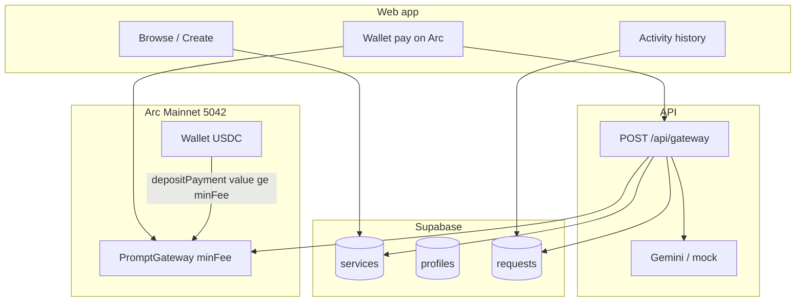
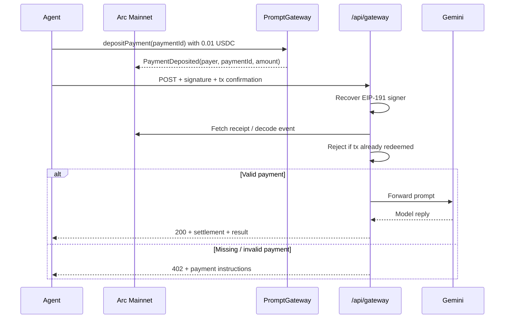

# arcdot.

**Pay-as-you-go API access for AI agents — settled in native USDC on [Arc](https://www.arc.network).**

[](https://docs.arc.network)
[](#license)

arcdot. turns ordinary API endpoints into **machine-payable services**. An agent (or app) pays a few cents in USDC on Arc, proves the payment, and instantly unlocks a gated model or data response — no accounts, no invoices, no human checkout.

| | |
|---|---|
| **Live app** | _Coming soon — Vercel URL_ |
| **Contract** | _Coming soon — Arc explorer link_ |
| **Network** | [Arc Mainnet](https://docs.arc.network) · Chain ID `5042` |
| **Explorer** | [explorer.arc.network](https://explorer.arc.network) / [explorer.arc.io](https://explorer.arc.io) |
| **Repo** | [github.com/M4N4N22/arcdot.](https://github.com/M4N4N22/arcdot.) |

---

## What problem we solve

AI agents can already call APIs. They still cannot **pay for them** in a way that is:

- **Tiny** — fractions of a dollar per call (micropayments)
- **Instant** — no waiting on cards, invoices, or API-key provisioning
- **Dollar-native** — costs and gas denominated in USDC, not a volatile gas token
- **Autonomous** — the agent pays, proves, and continues without a human in the loop

Today, premium models and data APIs are gated by API keys and human billing. That breaks agent workflows. arcdot. adds a thin economic layer: **pay → verify on Arc → unlock → respond**.

---

## Why Arc

arcdot. is designed around Arc’s stablecoin-native L1 — not bolted onto a chain that uses a separate gas token.

| Arc capability | How arcdot. uses it |
|---|---|
| **USDC as native gas** | Agents hold one asset for fees and micropayments |
| **Predictable dollar fees** | Gateway price is fixed at **0.01 USDC** per request |
| **EVM + fast finality** | Standard Solidity escrow + quick settlement checks via RPC |
| **Agent-ready money rails** | Fits Circle’s agentic / machine-commerce direction |

**Important (Arc USDC decimals):** native transfers and `msg.value` use **18 decimals**. `0.01 USDC` = `10000000000000000` (`1e16`) wei. The ERC-20 USDC view uses 6 decimals — arcdot. deposits use **native payable** transfers only. See [Arc stablecoin-native model](https://docs.arc.io/arc/concepts/stablecoin-native-model).

Docs: [Arc documentation](https://docs.arc.io) · [Gas & fees](https://docs.arc.io/arc/references/gas-and-fees) · [Developer portal](https://www.arc.network)

---

## How it works

### For humans (platform)

1. **Browse** published services or **Create** your own (wallet-signed).
2. **Connect** an Arc wallet and **pay** the service price in native USDC.
3. arcdot. **verifies** the payment on Arc, runs the service, and shows the reply.
4. **Activity** lists your recent unlocks (stored in Supabase when configured).

### For agents (machine)

1. Discover a service via `GET /api/services` or `GET /api/services/:slug`.
2. Call `depositPayment(paymentId)` on `PromptGateway` with `msg.value` equal to the service `price_wei` (must be ≥ platform `minFee` of **0.01 USDC** / `1e16` wei).
3. `POST /api/gateway` with payment confirmation headers + EIP-191 signature.
4. On failure, read **HTTP 402** payment instructions and retry.

---

## Architecture

### Repository layout

```text
arcdot./
├── README.md
├── contracts/                 # Hardhat — PromptGateway.sol (minFee)
└── next-app/
    ├── app/
    │   ├── services/          # Catalog + pay UI
    │   ├── create/            # Publish a service
    │   ├── activity/          # Request history
    │   └── api/
    │       ├── gateway/       # Pay → verify → Gemini
    │       ├── services/      # Catalog CRUD API
    │       └── me/requests/   # Activity API
    ├── lib/                   # Arc, catalog, supabase, agent helpers
    └── supabase/schema.sql    # Run in Supabase SQL editor
```

### System diagram



### Payment + unlock sequence



### Trust boundaries

| Layer | Responsibility |
|---|---|
| **PromptGateway** | Escrow `msg.value >= minFee`; mark `paymentId` used once; owner withdraws |
| **API route** | Load service price from catalog; signature + receipt checks; Gemini; persist request |
| **Supabase** | Public catalog, profiles, request history (no secrets) |
| **Client** | Connect wallet, pay on Arc, sign challenge |

---

## Tech stack

| Layer | Choice |
|---|---|
| App | Next.js (App Router), TypeScript, Tailwind CSS |
| Chain | Arc Mainnet (`5042`), native USDC |
| Contracts | Solidity `0.8.28`, Hardhat (`minFee`) |
| Wallet | RainbowKit + wagmi v2 + viem (Arc custom chain) |
| Data | Supabase (Postgres) — optional local in-memory seed if unset |
| RPC / crypto | [viem](https://viem.sh) |
| LLM | Google [Gemini](https://ai.google.dev) Flash |
| Hosting | Vercel |

---

## Setup

### Prerequisites

- Node.js 20+
- npm
- An Arc Mainnet wallet funded with **USDC** (gas + deploy + test payments) — required for on-chain deploy, optional for local Activity demo
- A [Gemini API key](https://aistudio.google.com/apikey) (optional if `MOCK_MODE=true`)

### 1. Clone

```bash
git clone https://github.com/M4N4N22/arcdot..git
cd arcdot.
```

### 2. Smart contract (`contracts/`)

**Testnet first (E2E):**

```bash
cd contracts
cp .env.example .env
# Set DEPLOYER_PRIVATE_KEY_TESTNET= (funded with Arc Testnet USDC)
npm install
npm test
npm run deploy:testnet
```

Paste the printed `PROMPT_GATEWAY_ADDRESS_TESTNET=…` block into `next-app/.env.local` and keep `NEXT_PUBLIC_ARC_NETWORK=testnet`.

**Mainnet (submission):**

```bash
# Set DEPLOYER_PRIVATE_KEY_MAINNET=
npm run deploy:arc
```

Then set `NEXT_PUBLIC_ARC_NETWORK=mainnet` and the `*_MAINNET` gateway vars.

The deploy script prints an explorer link and a ready-to-paste `.env.local` block.

Smoke-test a deposit after deploy:

```bash
GATEWAY_ADDRESS=0xYourGateway npm run deposit:arc
```

Network defaults (see `hardhat.config.ts`):

- RPC: `https://rpc.mainnet.arc.io`
- Chain ID: `5042`
- Constructor fee: `10000000000000000` (0.01 USDC native)

### 3. Supabase (recommended)

1. Create a project at [supabase.com](https://supabase.com).
2. Open **SQL Editor** and run [`next-app/supabase/schema.sql`](next-app/supabase/schema.sql) (creates tables + demo services).
3. Copy Project URL, **publishable** key, and **secret** key into `next-app/.env.local`
   (Dashboard → Settings → API Keys — prefer these over legacy anon / service_role).
4. Create a free [WalletConnect Cloud](https://cloud.walletconnect.com) project id → `NEXT_PUBLIC_WALLETCONNECT_PROJECT_ID` (required for RainbowKit mobile wallets)

Without Supabase env vars, the app falls back to a built-in in-memory seed catalog so local UI still works.

### 4. Web app (`next-app/`)

```bash
cd ../next-app
cp .env.example .env.local
```

Fill in Arc + Supabase + Gemini:

```env
NEXT_PUBLIC_SUPABASE_URL=
NEXT_PUBLIC_SUPABASE_PUBLISHABLE_KEY=
SUPABASE_SECRET_KEY=
PROMPT_GATEWAY_ADDRESS=
NEXT_PUBLIC_PROMPT_GATEWAY_ADDRESS=
ARC_RPC_URL=https://rpc.mainnet.arc.io
NEXT_PUBLIC_ARC_RPC_URL=https://rpc.mainnet.arc.io
GATEWAY_FEE_WEI=10000000000000000
GEMINI_API_KEY=
MOCK_MODE=false
DEMO_AGENT_SECRET=arcdot-demo-local
```

> Supabase: use **publishable** + **secret** keys from Dashboard → API Keys.
> Legacy `anon` / `service_role` still work as fallbacks if set as
> `NEXT_PUBLIC_SUPABASE_ANON_KEY` / `SUPABASE_SERVICE_ROLE_KEY`.

```bash
npm install
npm run dev
```

Open:

- [http://localhost:3000](http://localhost:3000) — landing  
- [http://localhost:3000/services](http://localhost:3000/services) — catalog  
- [http://localhost:3000/create](http://localhost:3000/create) — publish  
- [http://localhost:3000/studio](http://localhost:3000/studio) — seller earnings & manage  
- [http://localhost:3000/activity](http://localhost:3000/activity) — buyer history  
- [http://localhost:3000/api/health](http://localhost:3000/api/health) — ops health  

Connect a wallet on **Arc Mainnet**, open a service, pay, and unlock.

### 5. Deploy app to Vercel

From `next-app/`, import the project in [Vercel](https://vercel.com) (root directory = `next-app`), set the same env vars, and deploy.

---

## Milestones

| Milestone | Status | Deliverable |
|---|---|---|
| **M1 — Gateway V2** | Code ready · redeploy | Seller/platform split + `minFee` |
| **M2 — Settlement API** | Done | Price check, durable spent tx, pause, rate limit |
| **M3 — Platform UI** | Done | Browse / Create / Pay / Activity / Studio |
| **M4 — Persistence** | Done | Supabase schema + `schema_v2.sql` |
| **M5 — Live submission** | Next | Arc deploy + Vercel + README live links |

### Production checklist

- [ ] Supabase: run [`schema.sql`](next-app/supabase/schema.sql) then [`schema_v2.sql`](next-app/supabase/schema_v2.sql)
- [ ] Deploy **PromptGateway V2** (`npm run deploy:arc`) — constructor `(minFee, platformFeeBps)`
- [ ] Set `PROMPT_GATEWAY_ADDRESS` + `NEXT_PUBLIC_PROMPT_GATEWAY_ADDRESS`
- [ ] Set `PLATFORM_FEE_BPS` (default `1000` = 10%)
- [ ] `NEXT_PUBLIC_WALLETCONNECT_PROJECT_ID` from WalletConnect Cloud
- [ ] `GEMINI_API_KEY`, `MOCK_MODE=false`
- [ ] `ALLOW_DEMO_UNLOCK=false` / empty `DEMO_AGENT_SECRET` in production
- [ ] `GET /api/health` returns `ok: true` on Vercel
- [ ] Seller can withdraw from **Studio**; platform uses `withdrawPlatform`

### Your next actions (submission)

1. Supabase project → `schema.sql` + `schema_v2.sql` → paste keys  
2. `cd contracts && npm run deploy:arc` (V2 with fee bps)  
3. Paste gateway addresses into env  
4. Gemini key + production flags above  
5. Deploy `next-app` to Vercel; update README live links  
6. Submit to [Arc Microgrants](#arc-microgrants--what-you-must-have-to-qualify)

Sellers earn on-chain via `withdrawSeller`. Platform share via `withdrawPlatform` (owner).

## Arc Microgrants — what you must have to qualify

arcdot. is built to meet **[Arc Microgrants](https://www.arc.network)** requirements: a real, working proof on **Arc Mainnet** — not a deck, mockup, or testnet-only demo.

### Official program links

| Resource | Link |
|---|---|
| Arc home / builders | [arc.network](https://www.arc.network) |
| Request for builders (microgrants + path to grants) | [Blog: Request for Builders](https://www.arc.network/blog/the-unfinished-business-of-finance-machine-commerce-and-global-money) |
| Arc docs | [docs.arc.io](https://docs.arc.io) |
| Circle Developer Grants (larger / production path) | [circle.com/grant](https://www.circle.com/grant) |
| Arc House (community / programs) | [community.arc.io](https://community.arc.io) |

### Submission checklist (must-haves)

Use this before you submit. Every item is required for a complete Microgrant application:

- [ ] **Live deployment on Arc Mainnet** — contract callable on chain `5042` (not testnet-only)
- [ ] **Openable live product link** — Vercel (or other) URL reviewers can click
- [ ] **Public GitHub repo** — this repository
- [ ] **Short description** — what the project does **and** what it uses Arc for (USDC micropayments + gas)
- [ ] **Public builder profile** — GitHub, X, or Farcaster
- [ ] **Wallet that can receive USDC on Arc** — for payout if selected

### Explicitly not eligible

- Design mockups / slide decks only  
- Testnet-only builds  
- Projects with **no Arc component**  
- Work already funded by a Circle or Arc program  

### Timing (program window)

- Submissions close **October 14, 2026, 23:59 ET** (confirm on the live program page)  
- Decisions issued by **October 21, 2026** on a rolling basis — earlier submissions get earlier answers  

### What reviewers look for

Relevance to Arc, technical credibility, quality of what you shipped, and whether it is worth taking further. Promise counts more than traction at the microgrant stage.

---

## API sketch

`POST /api/gateway`

**Headers (agent):** payment confirmation, wallet address, EIP-191 signature  

**Body:** `{ "service", "input", "auth": { "issuedAt", "expiresAt" } }`  

**Responses:**

- `200` — settlement proof + model result  
- `402` — payment required + machine-readable checkout instructions  

`GET /api/gateway` — public fee / chain / gateway metadata  

---

## Security notes

- Never commit `.env`, private keys, or API keys  
- Gateway owner key is for withdrawals only — keep it offline from the web app  
- In-memory redeem cache is demo-grade; production should use durable storage  

---

## License

MIT — see repository license file when added.

---

Built for the agentic economy on **Arc** · Settled in **USDC**
