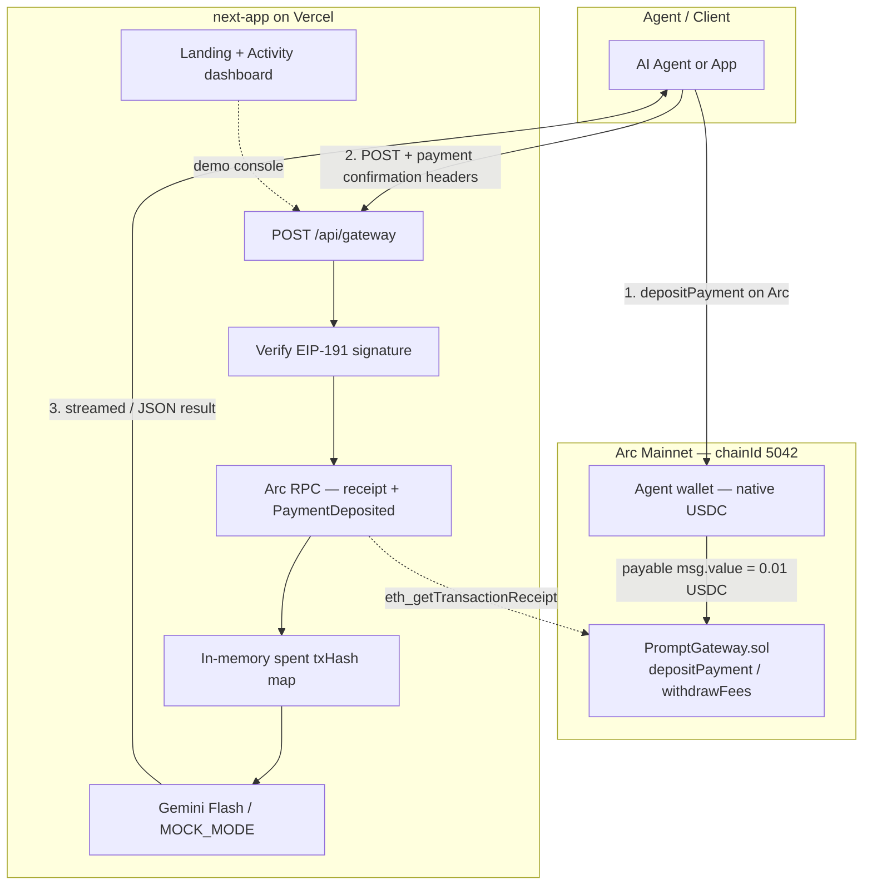
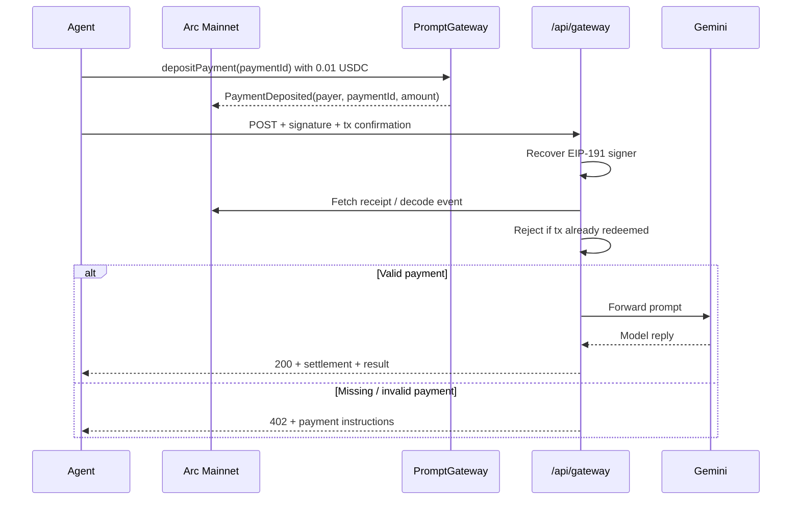

# arcdot.

**Pay-as-you-go API access for AI agents — settled in native USDC on [Arc](https://www.arc.network).**

[](https://docs.arc.network)
[](#license)

arcdot. turns ordinary API endpoints into **machine-payable services**. An agent (or app) pays a few cents in USDC on Arc, proves the payment, and instantly unlocks a gated model or data response — no accounts, no invoices, no human checkout.

| | |
|---|---|
| **Live app** | _Coming soon — Vercel URL_ |
| **Contract** | _Coming soon — Arc explorer link_ |
| **Network** | [Arc Mainnet](https://docs.arc.network) · Chain ID `5042` |
| **Explorer** | [explorer.arc.network](https://explorer.arc.network) / [explorer.arc.io](https://explorer.arc.io) |
| **Repo** | [github.com/M4N4N22/arcdot.](https://github.com/M4N4N22/arcdot.) |

---

## What problem we solve

AI agents can already call APIs. They still cannot **pay for them** in a way that is:

- **Tiny** — fractions of a dollar per call (micropayments)
- **Instant** — no waiting on cards, invoices, or API-key provisioning
- **Dollar-native** — costs and gas denominated in USDC, not a volatile gas token
- **Autonomous** — the agent pays, proves, and continues without a human in the loop

Today, premium models and data APIs are gated by API keys and human billing. That breaks agent workflows. arcdot. adds a thin economic layer: **pay → verify on Arc → unlock → respond**.

---

## Why Arc

arcdot. is designed around Arc’s stablecoin-native L1 — not bolted onto a chain that uses a separate gas token.

| Arc capability | How arcdot. uses it |
|---|---|
| **USDC as native gas** | Agents hold one asset for fees and micropayments |
| **Predictable dollar fees** | Gateway price is fixed at **0.01 USDC** per request |
| **EVM + fast finality** | Standard Solidity escrow + quick settlement checks via RPC |
| **Agent-ready money rails** | Fits Circle’s agentic / machine-commerce direction |

**Important (Arc USDC decimals):** native transfers and `msg.value` use **18 decimals**. `0.01 USDC` = `10000000000000000` (`1e16`) wei. The ERC-20 USDC view uses 6 decimals — arcdot. deposits use **native payable** transfers only. See [Arc stablecoin-native model](https://docs.arc.io/arc/concepts/stablecoin-native-model).

Docs: [Arc documentation](https://docs.arc.io) · [Gas & fees](https://docs.arc.io/arc/references/gas-and-fees) · [Developer portal](https://www.arc.network)

---

## How it works

1. **Agent requests** a gated service (`POST /api/gateway`) with a wallet signature and a payment confirmation.
2. **Server verifies** the Arc transaction: success, correct gateway contract, exact fee, matching payer, unused payment id.
3. **On success**, the server proxies to Gemini (or mock fallback) and returns the result.
4. **On failure**, the server responds with **HTTP 402** and machine-readable payment instructions so the agent can pay and retry.

Default gate price: **0.01 USDC** per request.

---

## Architecture

### Repository layout

```text
arcdot./
├── README.md                 # You are here
├── contracts/                # Hardhat — PromptGateway.sol (Arc Mainnet)
│   ├── contracts/
│   ├── scripts/deploy.ts
│   └── test/
└── next-app/                 # Next.js App Router (Vercel)
    ├── app/api/gateway/      # Payment verification + LLM proxy
    ├── app/dashboard/        # Live activity console
    ├── app/page.tsx          # Product landing
    └── lib/                  # Arc RPC, auth, Gemini
```

### System diagram



### Payment + unlock sequence



### Trust boundaries

| Layer | Responsibility |
|---|---|
| **PromptGateway** | Escrow exact fee; mark `paymentId` used once; owner withdraws |
| **API route** | Signature check, receipt verification, one-time redeem of tx hash, upstream proxy |
| **Client** | Sign challenge, pay on Arc, attach confirmation on retry |

---

## Tech stack

| Layer | Choice |
|---|---|
| App | Next.js (App Router), TypeScript, Tailwind CSS |
| Chain | Arc Mainnet (`5042`), native USDC |
| Contracts | Solidity `0.8.28`, Hardhat |
| RPC / crypto | [viem](https://viem.sh) |
| LLM | Google [Gemini](https://ai.google.dev) Flash (`GEMINI_API_KEY`) |
| Hosting | Vercel |

---

## Setup

### Prerequisites

- Node.js 20+
- npm
- An Arc Mainnet wallet funded with **USDC** (gas + deploy + test payments)
- A [Gemini API key](https://aistudio.google.com/apikey) (optional if `MOCK_MODE=true`)

### 1. Clone

```bash
git clone https://github.com/M4N4N22/arcdot..git
cd arcdot.
```

### 2. Smart contract (`contracts/`)

```bash
cd contracts
cp .env.example .env
# Set DEPLOYER_PRIVATE_KEY= (funded on Arc Mainnet)
npm install
npm test
npm run compile
npm run deploy:arc
```

Copy the printed `PromptGateway` address for the next step.

Network defaults (see `hardhat.config.ts`):

- RPC: `https://rpc.mainnet.arc.io`
- Chain ID: `5042`
- Constructor fee: `10000000000000000` (0.01 USDC native)

### 3. Web app (`next-app/`)

```bash
cd ../next-app
cp .env.example .env.local
```

Fill in:

```env
ARC_RPC_URL=https://rpc.mainnet.arc.io
PROMPT_GATEWAY_ADDRESS=0xYourGateway
GATEWAY_FEE_WEI=10000000000000000
GEMINI_API_KEY=your_key
GEMINI_MODEL=gemini-2.0-flash
MOCK_MODE=false
MOCK_MODE_ON_ERROR=true
```

```bash
npm install
npm run dev
```

Open [http://localhost:3000](http://localhost:3000) (landing) and [http://localhost:3000/dashboard](http://localhost:3000/dashboard) (activity console).

### 4. Deploy app to Vercel

From `next-app/`, import the project in [Vercel](https://vercel.com) (root directory = `next-app`), set the same env vars, and deploy. Point your Arc Microgrant submission at the **live URL**.

---

## Milestones

| Milestone | Status | Deliverable |
|---|---|---|
| **M1 — Gateway contract** | In progress | Gas-optimized `PromptGateway.sol` deployed on **Arc Mainnet** |
| **M2 — Settlement API** | In progress | `POST /api/gateway` verifies Arc payment + proxies Gemini |
| **M3 — Demo experience** | In progress | Landing + activity console showing pay → unlock → complete |
| **M4 — Live submission** | Planned | Public repo + live Vercel app + explorer contract link |

---

## Arc Microgrants — what you must have to qualify

arcdot. is built to meet **[Arc Microgrants](https://www.arc.network)** requirements: a real, working proof on **Arc Mainnet** — not a deck, mockup, or testnet-only demo.

### Official program links

| Resource | Link |
|---|---|
| Arc home / builders | [arc.network](https://www.arc.network) |
| Request for builders (microgrants + path to grants) | [Blog: Request for Builders](https://www.arc.network/blog/the-unfinished-business-of-finance-machine-commerce-and-global-money) |
| Arc docs | [docs.arc.io](https://docs.arc.io) |
| Circle Developer Grants (larger / production path) | [circle.com/grant](https://www.circle.com/grant) |
| Arc House (community / programs) | [community.arc.io](https://community.arc.io) |

### Submission checklist (must-haves)

Use this before you submit. Every item is required for a complete Microgrant application:

- [ ] **Live deployment on Arc Mainnet** — contract callable on chain `5042` (not testnet-only)
- [ ] **Openable live product link** — Vercel (or other) URL reviewers can click
- [ ] **Public GitHub repo** — this repository
- [ ] **Short description** — what the project does **and** what it uses Arc for (USDC micropayments + gas)
- [ ] **Public builder profile** — GitHub, X, or Farcaster
- [ ] **Wallet that can receive USDC on Arc** — for payout if selected

### Explicitly not eligible

- Design mockups / slide decks only  
- Testnet-only builds  
- Projects with **no Arc component**  
- Work already funded by a Circle or Arc program  

### Timing (program window)

- Submissions close **October 14, 2026, 23:59 ET** (confirm on the live program page)  
- Decisions issued by **October 21, 2026** on a rolling basis — earlier submissions get earlier answers  

### What reviewers look for

Relevance to Arc, technical credibility, quality of what you shipped, and whether it is worth taking further. Promise counts more than traction at the microgrant stage.

---

## API sketch

`POST /api/gateway`

**Headers (agent):** payment confirmation, wallet address, EIP-191 signature  

**Body:** `{ "service", "input", "auth": { "issuedAt", "expiresAt" } }`  

**Responses:**

- `200` — settlement proof + model result  
- `402` — payment required + machine-readable checkout instructions  

`GET /api/gateway` — public fee / chain / gateway metadata  

---

## Security notes

- Never commit `.env`, private keys, or API keys  
- Gateway owner key is for withdrawals only — keep it offline from the web app  
- In-memory redeem cache is demo-grade; production should use durable storage  

---

## License

MIT — see repository license file when added.

---

Built for the agentic economy on **Arc** · Settled in **USDC**
